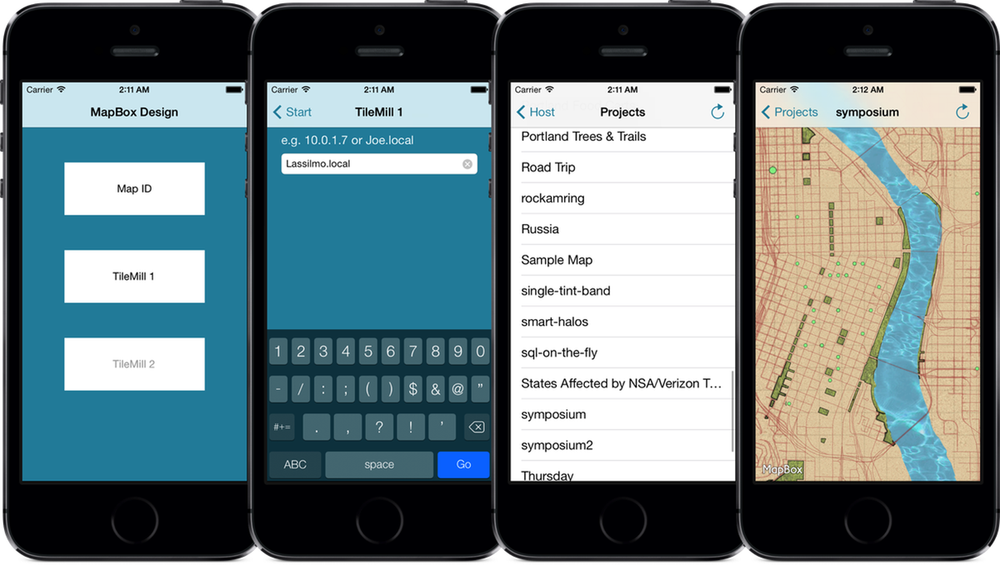

# MB Design

Enter a [MapBox map ID](https://www.mapbox.com/developers/api-overview/) or connect to a [TileMill](http://tilemill.com) or [TM2](http://github.com/mapbox/tm2) running on the same network as your iPhone and preview your map live, as you edit it, in a native iOS interface. 

